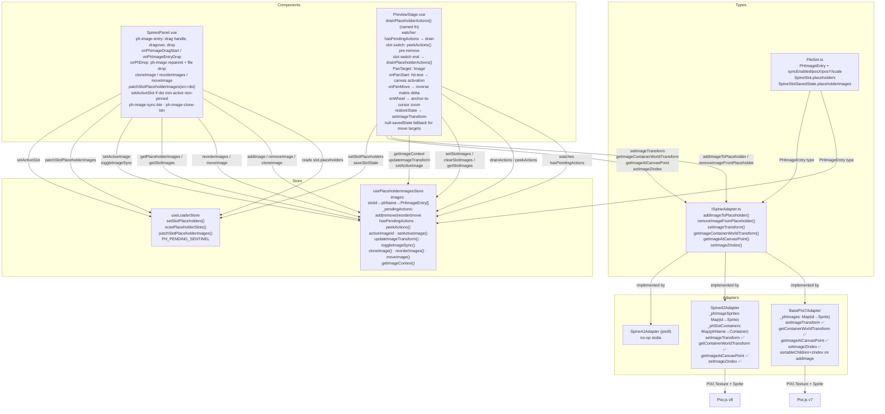

# Placeholder Image Children — Architecture Reference
_Added: 2026-04-22 · Updated: 2026-04-24 (Clone, Canvas Activation, Drag Reorder/Move)_

## Overview

Feature that allows dropping PNG/JPG images onto **placeholder slots** directly from the Spines panel. Each dropped image becomes a `PIXI.Sprite` child of the corresponding slot container in the Pixi scene graph. State is serialized into `SpineSlotSavedState` in-memory and restored on slot switch.

Each image carries its own **independent transform** (`posX`, `posY`, `scale`, `syncEnabled`). When `syncEnabled = false` — the image can be repositioned by dragging and scaled by scroll wheel, relative to the slot-container (bone) space. Transform is persisted automatically via `SpineSlotSavedState.placeholderImages`.

**Additional operations (added 2026-04-24):**
- **Clone** — duplicates a `PHImageEntry` in the same placeholder at (0, 0) with the original scale; fully independent
- **Canvas activation** — clicking a desynced sprite on the canvas activates it; topmost sprite (highest zIndex) wins when sprites overlap
- **Drag reorder** — drag handle on each entry reorders sprites within the same placeholder (zIndex updated live)
- **Drag move** — drag to a different placeholder drop zone (same or different spine) to reparent the sprite; target spine activates automatically if needed

**Scope:** slot-kind placeholders only (no bone-kind). No rotation, keyboard shortcuts, or undo/redo.

---

## Core Architecture: Action-Queue Bridge

Components never reference each other directly. Communication goes through the store:

```
SpinesPanel (Vue) ──push action──► usePlaceholderImagesStore ──drain──► PreviewStage ──call──► ISpineAdapter
```

`SpinesPanel` has no ref to `PreviewStage`. The store holds both the UI state (`images` map) and the pending action queue (`_pendingActions`). `PreviewStage` calls `drainPlaceholderActions()` when `hasPendingActions` fires AND explicitly after each slot switch completes (paths 5a and 5b) to flush actions that may have accumulated while `spineAdapter` was null during the async switch.

**Drain timing issue:** `hasPendingActions` and `activeSlotId` both change synchronously in the same JS tick (e.g., `moveImage` + `setActiveSlot`). Vue batches watcher flushes; by the time the drain watcher fires, `activeSlotId` may already be the new value while `spineAdapter` is still null (slot switch async). Returning early without draining leaves `_pendingActions` non-empty; since `hasPendingActions` doesn't change again, the watcher never re-fires. Fix: `drainPlaceholderActions()` is a named function called both from the watcher and explicitly at the end of paths 5a/5b.

---

## Key Types

```ts
// src/core/types/FileSet.ts
interface PHImageEntry {
  imageId: string
  fileName: string
  dataURL: string
  syncEnabled: boolean  // default: true — when false, drag/scroll targets this image
  posX: number          // sprite.x in slot-container local space (default: 0)
  posY: number          // sprite.y in slot-container local space (default: 0)
  scale: number         // sprite.scale.set(scale) (default: 1)
}

// SpineSlot — written by PreviewStage after spine load
placeholders?: Array<{ name: string; kind: 'bone' | 'slot' }>

// SpineSlotSavedState — in-memory only, not persisted to localStorage
placeholderImages?: Record<string, PHImageEntry[]>  // phName → entries

// src/core/types/ISpineAdapter.ts
addImageToPlaceholder(placeholderName: string, dataURL: string, imageId: string): void
removeImageFromPlaceholder(placeholderName: string, imageId: string): void
setImageTransform(imageId: string, posX: number, posY: number, scale: number): void
getImageContainerWorldTransform(imageId: string): { a: number; b: number; c: number; d: number; tx: number; ty: number } | null
getImageAtCanvasPoint(x: number, y: number): string | null  // topmost sprite under canvas point
setImageZIndex(imageId: string, zIndex: number): void
```

`PHImageEntry` is defined in `FileSet.ts` (not in the store) to avoid a circular import — `SpineSlotSavedState` references it, and `FileSet.ts` must not import from stores.

---

## Action Queue

`PHImageAction` is a flat interface with optional fields discriminated by `type`:

| type | required fields | effect |
|------|-----------------|--------|
| `'add'` | `slotId, phName, imageId, dataURL` | create sprite in active slot's adapter |
| `'remove'` | `slotId, phName, imageId` | destroy sprite in active slot's adapter |
| `'reorder'` | `slotId, phName, orderedIds[]` | apply new zIndex sequence to sprites in any mounted adapter |
| `'move'` | `slotId, phName, imageId, dataURL, dstSlotId, dstPhName, scale` | remove sprite from src adapter, add to dst adapter (any mounted) |

`'add'` and `'remove'` are guarded by `slotId !== activeSlotId` (skipped for inactive slots). `'reorder'` and `'move'` resolve the adapter via `mountedAdapters.get(slotId)` — they operate on any mounted adapter regardless of which slot is active.

---

## Data Flow: Adding an Image

1. `SpinesPanel.onPhDrop()` — filters `image/*`, calls `phImagesStore.addImage(slotId, phName, file)`
2. `usePlaceholderImagesStore.addImage()` — `readFileAsDataURL(file)` → `crypto.randomUUID()` → push to `images[slotId][phName]` + push `{ type:'add', ... }` to `_pendingActions`
3. `hasPendingActions` computed flips → `PreviewStage` drain watcher fires → `drainPlaceholderActions()`
4. `spineAdapter.addImageToPlaceholder(phName, dataURL, imageId)` called; if entry has non-default transform, `setImageTransform` called immediately after
5. Adapter: `slotContainers[findIndex(slots, phName)]` → non-cached `new PIXI.BaseTexture(img)` + `new PIXI.Sprite(texture)` → `sprite.anchor.set(0.5, 0.5)` → `target.sortableChildren = true; sprite.zIndex = target.children.length` → `findDeepestTarget(container).addChild(sprite)` → `_phImages.set(imageId, sprite)`
6. Vue re-renders `phImagesStore.getPlaceholderImages(slotId, phName)` → thumbnail entry visible

**zIndex:** `sprite.zIndex = target.children.length` (before `addChild`) assigns incrementing indices. `target.sortableChildren = true` tells Pixi to respect zIndex when rendering. Newer images always render on top.

## Data Flow: Removing an Image

`phImagesStore.removeImage(slotId, phName, imageId)` → splices from `images` map + pushes `{ type:'remove' }` action → drain → `spineAdapter.removeImageFromPlaceholder(_, imageId)` → `sprite.parent?.removeChild(sprite)` → `sprite.destroy(...)` → `_phImages.delete(imageId)`

## Data Flow: Cloning an Image

`phImagesStore.cloneImage(slotId, phName, imageId)`:
1. Finds `PHImageEntry` in `images[slotId][phName]`
2. Creates new entry with new UUID, same `dataURL`/`fileName`/`syncEnabled`/`scale`, `posX: 0, posY: 0`
3. Pushes new entry to `images[slotId][phName]`
4. Pushes `{ type:'add', ..., dataURL }` to `_pendingActions`
5. Drain: `addImageToPlaceholder` called; since `scale` may differ from 1, `setImageTransform` is called if `posX !== 0 || posY !== 0 || scale !== 1`

## Data Flow: Reordering Images

`phImagesStore.reorderImages(slotId, phName, orderedIds)`:
1. Sorts `images[slotId][phName]` array to match `orderedIds` order
2. Pushes `{ type:'reorder', slotId, phName, orderedIds }` to `_pendingActions`
3. Drain: finds adapter via `slotId === activeSlotId ? spineAdapter : mountedAdapters.get(slotId)`; calls `adapter.setImageZIndex(id, idx)` for each id in order

`SpinesPanel` drag: `dragstart` on handle sets `application/x-ph-image` data; `drop` on another `ph-image-entry` in same placeholder → computes new order (insert srcImageId at original dstIdx in the pre-splice array) → calls `reorderImages`.

**Correct splice order:** `dstIdx` must be captured BEFORE `entries.splice(srcIdx, 1)`. Using `entries.indexOf(dstImageId)` after splice gives the shifted index, producing wrong results for forward moves.

## Data Flow: Moving to Another Placeholder

`phImagesStore.moveImage(srcSlotId, srcPhName, imageId, dstSlotId, dstPhName)`:
1. Splices entry from `images[srcSlotId][srcPhName]`; clears `activeImageId` if matches
2. Appends `{ ...entry, posX: 0, posY: 0 }` to `images[dstSlotId][dstPhName]` (position resets; scale preserved)
3. Pushes `{ type:'move', slotId: srcSlotId, phName: srcPhName, imageId, dataURL, dstSlotId, dstPhName, scale }` to `_pendingActions`

`SpinesPanel` then immediately calls:
```ts
loaderStore.patchSlotPlaceholderImages(srcSlotId, phImagesStore.getSlotImages(srcSlotId))
// and if dst is non-active non-pinned:
loaderStore.patchSlotPlaceholderImages(dstSlotId, phImagesStore.getSlotImages(dstSlotId))
loaderStore.setActiveSlot(dstSlotId)
```

`patchSlotPlaceholderImages` updates `slot.savedState.placeholderImages` for any slot with an existing savedState. This ensures:
- Returning to srcSlot does not restore the moved image from stale savedState
- Activating dstSlot via `restoreState` picks up the moved image even if drain hasn't processed yet

Drain `'move'` processing:
- `srcAdapter = slotId === activeSlotId ? spineAdapter : mountedAdapters.get(slotId)` → `removeImageFromPlaceholder`
- `dstAdapter = dstSlotId === activeSlotId ? spineAdapter : mountedAdapters.get(dstSlotId)` → `addImageToPlaceholder` + `setImageTransform` + `setImageZIndex`
- `addImageToPlaceholder` idempotency guard prevents double-add when `restoreState` already created the sprite

---

## Independent Transform

Each `PHImageEntry` carries `posX`, `posY`, `scale`, `syncEnabled` — coordinates in the **slot-container local space** (`sprite.x / sprite.y`). This mirrors the spine-slot desynced mode (`SpineSlot.syncEnabled / indPosX / indPosY / indZoom`) but operates one level deeper: inside the container that follows the bone, not inside the global scene.

### Spatial Model

```
Canvas space
  └─ Spine scene (global viewport zoom/pan)
       └─ Slot container (follows bone transform; has worldTransform)
            └─ PIXI.Sprite (x=posX, y=posY, scale=scale, zIndex=N in container-local)
```

`getImageContainerWorldTransform(imageId)` returns `{ a, b, c, d, tx, ty }` — the full affine matrix of `sprite.parent` in canvas space. Converting canvas-space delta → container-local delta requires inverting the 2×2 linear part: `localDX = (d*dx - c*dy) / det; localDY = (-b*dx + a*dy) / det`. Guard: `|det| < 1e-10 → return`.

### Store State

```
activeImageId: ref<string | null>   — global singleton: one active image at a time across all slots
setActiveImage(id)                  — set or clear
updateImageTransform(slotId, phName, imageId, posX, posY, scale) — mutates PHImageEntry live
toggleImageSync(slotId, phName, imageId) — flips syncEnabled; posX/posY/scale unchanged
cloneImage(slotId, phName, imageId) — creates independent copy at (0,0) with same scale
reorderImages(slotId, phName, orderedIds) — reorders array + pushes 'reorder' action
moveImage(srcSlotId, srcPhName, imageId, dstSlotId, dstPhName) — reparents entry + pushes 'move' action
getImageContext(imageId) → { slotId, phName, entry } | null — lookup by id across all slots/phs
peekActions() → readonly PHImageAction[] — read queue without draining (used in slot switch pre-processing)
```

`addImage` sets defaults: `syncEnabled: true, posX: 0, posY: 0, scale: 1`.
`removeImage` clears `activeImageId` if the removed imageId matches.
`moveImage` clears `activeImageId` if the moved imageId matches.

### Canvas Interaction (`PreviewStage.vue`)

`PanTarget` extended to `'global' | 'background' | 'slot' | 'image'`.

**Canvas click activation (added 2026-04-24):**
In `onPanStart`, before the priority-check block, a hit-test fires:
```ts
if (!e.shiftKey && containerRef.value && spineAdapter) {
  const rect = containerRef.value.getBoundingClientRect()
  const hitId = spineAdapter.getImageAtCanvasPoint(e.clientX - rect.left, e.clientY - rect.top)
  if (hitId) {
    const hitCtx = placeholderImagesStore.getImageContext(hitId)
    if (hitCtx && !hitCtx.entry.syncEnabled && hitCtx.slotId === loaderStore.activeSlotId) {
      placeholderImagesStore.setActiveImage(hitId)
    }
  }
}
```
Only desynced images in the active slot can be activated this way. `getImageAtCanvasPoint` returns the imageId with the highest `zIndex` among all sprites whose bounds contain the point (`sprite.containsPoint(new PIXI.Point(x, y))`). Activation + drag start happen in the same `mousedown`.

**`onPanStart` priority order:**
1. `shiftKey` → `'global'`
2. `backgroundStore.isActive && !syncEnabled` → `'background'`
3. Hit-test → activate desynced image if found (then fall through to step 4)
4. Active desynced image in current slot → `'image'` (snapshots `imageMatrix` + `px/py`)
5. `activeSlot.syncEnabled === false` → `'slot'`
6. else → `'global'`

**`onPanMove` — `'image'` case:** inverse-matrix delta, `updateImageTransform` (store) + `setImageTransform` (adapter) directly — no action queue.

**`onWheel` — image zoom block:** anchor-to-cursor zoom, scale clamped to `[0.05, 20]`.

**Slot switch watcher:** `placeholderImagesStore.setActiveImage(null)`.

### Pending Activation (inactive slot)

Clicking a thumbnail in an **inactive** slot:
1. `SpinesPanel.onImageThumbClick` saves imageId in `pendingImageToActivate` (local `ref`)
2. Calls `loaderStore.setActiveSlot(slotId)` + expands tree
3. `watch(activeSlotId)` in SpinesPanel fires → verifies imageId still exists → `setActiveImage(pending)`

---

## State Save / Restore on Slot Switch

**Save** (`watch(activeSlotId)` — before adapter is parked/destroyed):
```ts
loaderStore.saveSlotState(oldId, {
  ...existingFields,
  placeholderImages: placeholderImagesStore.getSlotImages(oldId),
})
```

**Pre-move sprite removal** (added 2026-04-24):
Before parking/destroying the old adapter, the slot switch watcher calls `peekActions()` to eagerly remove sprites for any pending `'move'` actions sourced from the old slot:
```ts
for (const action of placeholderImagesStore.peekActions()) {
  if (action.type === 'move' && action.slotId === oldId && action.imageId) {
    spineAdapter.removeImageFromPlaceholder(action.phName, action.imageId)
  }
}
```
This handles the race where the drain watcher fires after `activeSlotId` changed but before the adapter is parked, causing `mountedAdapters.get(srcSlotId)` to miss the parked adapter.

**`patchSlotPlaceholderImages` (useLoaderStore):**
Updates `savedState.placeholderImages` for any slot (active or not) that already has a savedState. Called by SpinesPanel on both src and dst slots immediately after `moveImage`:
- Src patch: prevents returning to srcSlot and seeing the moved image restored from stale savedState
- Dst patch: ensures `restoreState` sees the moved image if `setActiveSlot` triggers path 5b before the drain runs

**Restore (normal path — path 5b):**
```ts
await loadSpine(slot.fileSet, newId, false)
restoreState(slot.savedState)
// Fallback: create sprites for images moved here before this slot had savedState
if (!slot.savedState) {
  const liveImages = placeholderImagesStore.getSlotImages(newId)
  for (const [phName, entries] of Object.entries(liveImages))
    for (const entry of entries) {
      spineAdapter?.addImageToPlaceholder(phName, entry.dataURL, entry.imageId)
      spineAdapter?.setImageTransform(entry.imageId, entry.posX ?? 0, entry.posY ?? 0, entry.scale ?? 1)
    }
}
applySkins()
applyPlaceholderLabels()
drainPlaceholderActions()  // flush any actions stuck during the async switch
```

**Restore (path 5a — pinned re-mount):** same block; ends with `drainPlaceholderActions()`.

**Restore (pinned non-active mount — pin watcher):** same image block; ends with `drainPlaceholderActions()`.

**`restoreState(s)` inner block:**
```ts
if (s.placeholderImages) {
  placeholderImagesStore.setSlotImages(slot.id, s.placeholderImages)
  for (const [phName, entries] of Object.entries(s.placeholderImages))
    for (const entry of entries) {
      spineAdapter.addImageToPlaceholder(phName, entry.dataURL, entry.imageId)
      spineAdapter.setImageTransform(entry.imageId, entry.posX ?? 0, entry.posY ?? 0, entry.scale ?? 1)
    }
} else {
  placeholderImagesStore.clearSlotImages(slot.id)
}
```

---

## Placeholder Tree in SpinesPanel

`slot.placeholders` is populated by `PreviewStage` after spine load. Pre-scan on slot add via `scanPlaceholderSlots()`.

**`ph-image-entry` structure:**
```
[drag handle ⠿] [thumbnail] [filename] [sync-btn 🔗] [clone-btn] [remove ×]
```
- **Drag handle** — `draggable="true"` span; `@dragstart` sets `application/x-ph-image` data `{imageId, srcSlotId, srcPhName}`
- **Row** — `@dragover.prevent` + `@drop` receive ph-image drops for reorder/reparent
- **`ph-drop-zone`** — receives both file drops and ph-image drops (ph-image checked first via `dataTransfer.getData('application/x-ph-image')`)

**Drag state refs:** `draggingPhImageId`, `dragOverPhImageId` — CSS classes `ph-image-entry--dragging` (opacity 0.4) and `ph-image-entry--drag-over` (dashed outline).

**Drop logic:**
- Same placeholder: reorder via `reorderImages` (insert src at original dstIdx)
- Different placeholder (same or different spine): `moveImage` + `patchSlotPlaceholderImages(src)` + conditionally `patchSlotPlaceholderImages(dst)` + `setActiveSlot(dst)` if dst non-active non-pinned

---

## Adapter Implementation

### BasePixi7Adapter (pixi7 — all Spine versions via inheritance)
```ts
private _phImages: Map<string, PIXI.Sprite> = new Map()  // imageId → Sprite

addImageToPlaceholder(placeholderName, dataURL, imageId) {
  if (this._phImages.has(imageId)) return  // idempotency guard
  // ...
  const img = new Image(); img.src = dataURL
  const sprite = new PIXI.Sprite(new PIXI.Texture(new PIXI.BaseTexture(img)))
  sprite.anchor.set(0.5, 0.5); sprite.x = 0; sprite.y = 0
  ;(sprite as any).__phImage = true
  const target = findDeepestTarget(container)
  target.sortableChildren = true
  sprite.zIndex = target.children.length
  target.addChild(sprite)
  this._phImages.set(imageId, sprite)
}

setImageTransform(imageId, posX, posY, scale) { sprite.x = posX; sprite.y = posY; sprite.scale.set(scale) }
setImageZIndex(imageId, zIndex) { if (sprite) sprite.zIndex = zIndex }
getImageContainerWorldTransform(imageId) { /* returns sprite.parent.worldTransform fields */ }
getImageAtCanvasPoint(x, y) {
  // returns imageId with highest zIndex among sprites where sprite.containsPoint(new PIXI.Point(x, y))
}
```

### Spine42Adapter (pixi8)
```ts
private _phImageSprites: Map<string, PIXI.Sprite> = new Map()
private _phSlotContainers: Map<string, PIXI.Container> = new Map()

addImageToPlaceholder(placeholderName, dataURL, imageId) {
  if (this._phImageSprites.has(imageId)) return
  // one phContainer per placeholder via addSlotObject()
  phContainer.sortableChildren = true
  sprite.zIndex = phContainer.children.length
  phContainer.addChild(sprite)
  // async texture via img.onload
}

setImageZIndex(imageId, zIndex) { if (sprite) sprite.zIndex = zIndex }
getImageAtCanvasPoint(x, y) { /* same logic via _phImageSprites */ }
```

### Spine41Adapter (pixi8 stub)
All placeholder methods are no-ops / return null.

---

## Decision Log

### Full 6-element affine matrix for anchor zoom
`getImageContainerWorldTransform` returns `{ a, b, c, d, tx, ty }`. Simplified (only tx/ty/scaleX/scaleY) fails when slot container has rotation from an animated bone.

### Direct call for drag/scroll transform (no action queue)
`updateImageTransform` (store) + `setImageTransform` (adapter) called directly in `mousemove`/`wheel` — no queue, no throttle. Queuing high-frequency events causes one-tick lag where sprite follows cursor.

### `pendingImageToActivate` in SpinesPanel, not in store
Local `ref` in `SpinesPanel.vue`. No other component needs this state.

### `posX, posY` in container-local space
Direct `sprite.x / sprite.y`. Canvas-space storage would break on global viewport pan/zoom changes.

### Store as action-queue bridge
`usePlaceholderImagesStore` is the message bus. `defineExpose` + prop drilling alternative rejected — deep coupling.

### `imageId` generated in store, not returned by adapter
`crypto.randomUUID()` in `addImage()` before enqueueing. Adapter is a render target; store owns identity.

### `cloneImage` uses action queue, not direct adapter call
Clone is a one-time operation (not high-frequency). Queue ensures correct ordering with other pending actions.

### `reorderImages` + `moveImage` use action queue, operate on any mounted adapter
Unlike `add`/`remove` (active slot only), `reorder` and `move` find adapters via `mountedAdapters.get(slotId)` — they work across pinned non-active slots without requiring a slot switch.

### `drainPlaceholderActions()` called explicitly after slot switch paths
The `hasPendingActions` watcher cannot re-fire on the same `true` value. If drain returns early (`!spineAdapter`) during an async slot switch, `_pendingActions` stays non-empty. Calling `drainPlaceholderActions()` at the end of paths 5a/5b/pin-mount guarantees flush once the new adapter is valid.

### `patchSlotPlaceholderImages` patches savedState for BOTH src and dst on move
If only dst is patched, returning to src after a move (without an intervening slot switch for src) restores the old savedState which still contains the moved image. Always patching src prevents this phantom restore.

### `peekActions()` for pre-park sprite removal
Drain watcher fires after `activeSlotId` changes but before the slot switch watcher parks the old adapter. `mountedAdapters.get(srcSlotId)` returns undefined at that moment. `peekActions()` in the slot switch watcher, called before park/destroy, uses the still-live `spineAdapter` to remove the sprite correctly. Actions remain in `_pendingActions` for the drain to process the dst-add.

### `sortableChildren = true` + incrementing `zIndex`
Pixi only respects `zIndex` when the parent container has `sortableChildren = true`. Set on `target` at every `addImageToPlaceholder` call (idempotent). zIndex = `target.children.length` before `addChild` → first added = 0, each subsequent = +1. Higher = on top.

---

## Dependency Map



---

## Adapter Implementation Notes

### Spine 4.2 / Pixi8 — `addSlotObject` API

`spine-pixi-v8` має **не** `slotContainers[]`, а `addSlotObject(slotRef, container)` API:

```ts
// slotRef can be: string (name), number (index), or Slot object
spine.addSlotObject(placeholderName, container)
// → container follows bone transform each frame automatically
// → container.includeInBuild = false (excluded from batch renderer)
```

`Spine42Adapter` кешує контейнери у `_phSlotContainers: Map<string, PIXI.Container>` — один контейнер на placeholder, спрайти додаються як дочірні. `findDeepestContainerTarget` видалено (Pixi7-only helper).

**Версії:** Spine 3.8, 4.0, 4.1 (всі через `BasePixi7Adapter` / Pixi7) — ✅; Spine 4.2 (Pixi8) — ✅.

---

## Bug History

### Bug 1 — New images nested inside previous images in the same placeholder
_Fixed: 2026-04-23_

`findDeepestTarget` descended into previously-added user sprites (`PIXI.Sprite` has `.children[]`). Fix: mark user sprites with `__phImage = true`; filter skips `__phImage` nodes.

### Bug 2 — Sprite duplicated after switching away from and back to a slot
_Fixed: 2026-04-23_

Pinned adapter reuse + re-calling `addImageToPlaceholder` created a second sprite for the same imageId. Fix: idempotency guard `if (_phImages.has(imageId)) return`.

### Bug 3 — Activation click only worked on the thumbnail image
_Fixed: 2026-04-23_

`@click.stop` was on `` only. Fix: moved to the parent `<div class="ph-image-entry">`.

### Bug 4 — Crash after adding image to sp2, switching between pinned sp1 and sp2
_Fixed: 2026-04-23_

`PIXI.Texture.from(dataURL)` shared global cache — destroying sp2's texture nulled sp1's BaseTexture. Fix: `new PIXI.BaseTexture(new Image())` per call — unique cache key per adapter per image.

### Bug 5 — Placeholder images not restored after pinning an inactive spine
_Fixed: 2026-04-24_

Pin watcher mounted the adapter and restored animations but did not restore placeholder images. Fix: added the `placeholderImages` restore block (matching path 5b) inside the pin watcher's mount loop, followed by `drainPlaceholderActions()`.

### Bug 6 — Clone image did not apply scale immediately
_Fixed: 2026-04-24_

`drainPlaceholderActions` called `addImageToPlaceholder` (creates sprite at scale=1) but did not call `setImageTransform` for entries with non-default scale. Fix: after `addImageToPlaceholder`, check store context and call `setImageTransform` if `posX !== 0 || posY !== 0 || scale !== 1`.

### Bug 7 — Move sprite remained in source spine after reparenting
_Fixed: 2026-04-24_

**Root cause:** drain watcher fired after `activeSlotId` changed to dstSlotId but before the slot switch watcher ran. `mountedAdapters.get(srcSlotId)` returned undefined (adapter not yet parked). For pinned src, adapter was later parked (not destroyed) — sprite persisted.

**Fix:** `peekActions()` in slot switch watcher (before park/destroy) eagerly removes sprites for pending `'move'` src actions using the still-live `spineAdapter`. Drain later processes dst-add (idempotency guards prevent double-add).

### Bug 8 — Second move from same source had no effect on canvas
_Fixed: 2026-04-24_

Drain watcher returned early when `!spineAdapter` (during async slot switch) WITHOUT calling `drainActions()`. `_pendingActions` stayed non-empty; `hasPendingActions` stayed `true` with no value change → watcher never re-fired. Second `moveImage` added another action but watcher still didn't fire (value unchanged).

**Fix:** Extracted drain logic into `drainPlaceholderActions()` called explicitly at end of paths 5a/5b/pin-mount. After slot switch completes (`spineAdapter` valid), all stuck actions are processed.

### Bug 9 — Moved image restored to source spine on next activation
_Fixed: 2026-04-24_

When dst was already active (no slot switch), src's `savedState.placeholderImages` was never updated — it still held the moved image. On returning to src, `restoreState` would recreate the sprite.

**Fix:** `patchSlotPlaceholderImages(srcSlotId, getSlotImages(srcSlotId))` called immediately after `moveImage` in SpinesPanel, for both drop handlers. Patches savedState with the post-move (empty) state before any slot switch.

### Bug 10 — Reorder within same placeholder had no effect (forward drag) or wrong result
_Fixed: 2026-04-24_

`entries.indexOf(dstImageId)` was called AFTER `entries.splice(srcIdx, 1)`, giving the shifted (post-removal) index. For forward moves (srcIdx < dstIdx), this inserted src BEFORE dst instead of AT dst's original position, producing no visible change (1→2) or wrong index (1→3 gave index 2).

**Fix:** Capture `dstIdx = entries.indexOf(dstImageId)` before splice, then `entries.splice(dstIdx, 0, srcImageId)` — src lands at the original position of dst in all cases.
